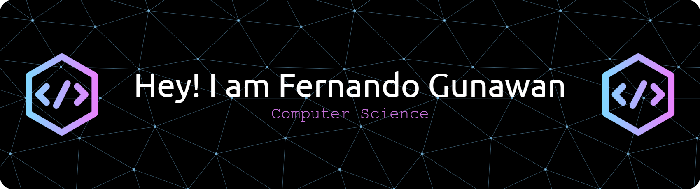

<h3 align="center">A Computer Science Student from Indonesian</h3>
<h1></h1>
🌱 I’m currently learning Frameworks, AI, Data Science

💬 Ask me about **Python, Next.js**

<h3 align="left">Connect with me:</h3>

<h3 align="left">Languages and Tools:</h3>

  

